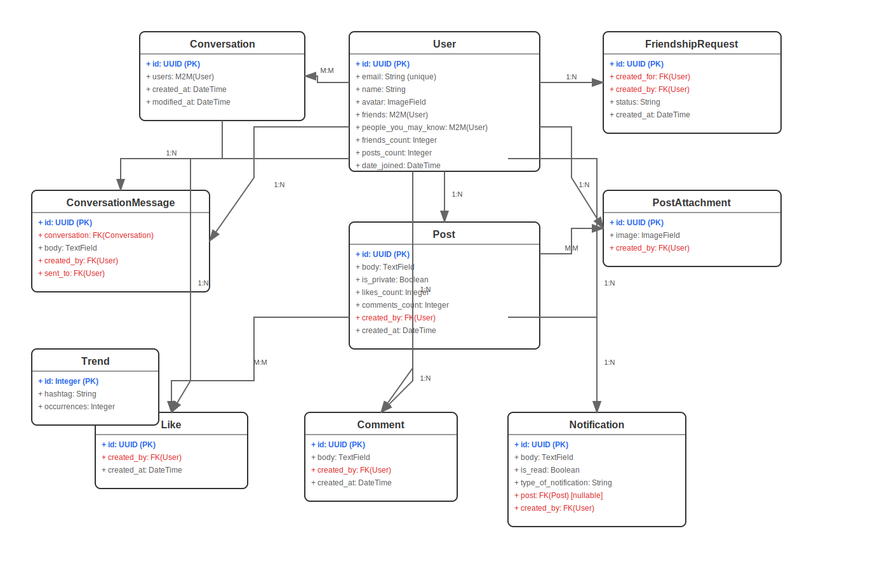

# 🌟 Frenzo — Modern Social Media Platform

Welcome to **Frenzo** — a modern social media platform designed for seamless interaction, built with cutting-edge technologies for both its frontend and backend.

This repository contains the complete codebase for Frenzo, encompassing a powerful **Django REST Framework API** and a dynamic **Vue 3 + Vite frontend**.

---

## 🚀 Project Overview

Frenzo aims to provide a robust and scalable social media experience, featuring:

* **User Authentication:** Secure JWT-based authentication for all user interactions.
* **User Accounts:** Comprehensive user profiles and management.
* **Posts & Interactions:** Create, like, and comment on posts.
* **Real-time Chat:** A dedicated messaging system for connected users.
* **Notifications:** Stay updated with activity relevant to your account.
* **Search Functionality:** Easily find users, posts, and more.
* **Media Uploads:** Support for images and other media content.

---

## ⚙️ Monorepo Structure

```

frenzo/  
├── backend/             \# Django REST Framework API  
│   ├── account/  
│   ├── post/  
│   ├── chat/  
│   ├── notification/  
│   ├── search/  
│   ├── backend/  
│   ├── media/  
│   ├── manage.py  
│   └── requirements.txt  
├── frontend/            \# Vue 3 + Vite Application  
│   ├── public/  
│   ├── src/  
│   │   ├── assets/  
│   │   ├── components/  
│   │   ├── pages/  
│   │   ├── router/  
│   │   ├── store/  
│   │   └── main.js  
│   ├── index.html  
│   ├── package.json  
│   ├── tailwind.config.js  
│   └── vite.config.js  
├── .gitignore  
└── README.md            \# This file  

```

---

# DRF Project - Database Schema

## UML Class Diagram



### Interactive Version
For an interactive version with zoom and pan capabilities, visit: [Interactive UML Diagram](https://yourusername.github.io/yourrepo/uml-diagram.html)

## Database Models

### Core Models
- **User**: Main user entity with authentication and profile data
- **Post**: User-generated content with privacy controls
- **Comment**: Comments on posts
- **Like**: Like interactions on posts

### Communication Models  
- **Conversation**: Private messaging between users
- **ConversationMessage**: Individual messages in conversations
- **FriendshipRequest**: Friend request management

### Support Models
- **Notification**: System notifications for users
- **PostAttachment**: File attachments for posts
- **Trend**: Trending hashtags tracking


## 🚀 Getting Started (Overall Setup)

To get the entire Frenzo application running locally, follow these steps:

1.  **Clone the Repository:**
    ```bash
    git clone [https://github.com/thetorangi/frenzo.git](https://github.com/thetorangi/frenzo.git)
    cd frenzo
    ```

2.  **Set up the Backend:** (Refer to the Backend Installation section below)

3.  **Set up the Frontend:** (Refer to the Frontend Installation section below)

Once both are set up and running, the frontend at `http://localhost:5173` will automatically connect to the backend at `http://127.0.0.1:8000`.

---

# 🧠 Frenzo Backend — Powered by Django REST Framework

This is the **backend** for Frenzo, built with **Django 4.2** and **Django REST Framework**. It provides a robust and scalable API for all social media functionalities.

## 📦 Backend Tech Stack

* **Python 3.10+**
* **Django 4.2**
* **Django REST Framework**
* **SimpleJWT** (for JWT authentication)
* **Pillow** (for robust image handling)
* **CORS Headers** (for cross-origin resource sharing)
* **SQLite** (default database for development)

## ⚙️ Backend Installation & Setup

1.  **Navigate to the Backend Directory:**
    ```bash
    cd backend
    ```

2.  **Create a Virtual Environment:**
    ```bash
    python -m venv venv
    source venv/bin/activate   # On Windows: venv\Scripts\activate
    ```

3.  **Install Dependencies:**
    ```bash
    pip install -r requirements.txt
    ```

4.  **Apply Migrations:**
    ```bash
    python manage.py migrate
    ```

5.  **Create a Superuser:**
    ```bash
    python manage.py createsuperuser
    ```

6.  **Run the Development Server:**
    ```bash
    python manage.py runserver
    ```
    The backend API will be accessible at: **http://127.0.0.1:8000**

## 🔑 Backend API Authentication (JWT)

Frenzo uses **JWT (JSON Web Tokens)** via `djangorestframework-simplejwt`.

### Endpoints

| Endpoint           | Method | Description                 |
| :----------------- | :----- | :-------------------------- |
| `/api/token/`      | `POST` | Get access and refresh tokens |
| `/api/token/refresh/` | `POST` | Refresh access token        |

### Header Format

Include your access token in the `Authorization` header for protected routes:
`Authorization: Bearer <your_access_token>`

### JWT Configuration

```python
SIMPLE_JWT = {
    'ACCESS_TOKEN_LIFETIME': timedelta(days=30),
    'REFRESH_TOKEN_LIFETIME': timedelta(days=180),
}
````

### 🌐 Backend CORS Configuration

```python
CORS_ALLOWED_ORIGINS = [
    "http://localhost:5173", # Frontend URL
]
CORS_ALLOW_CREDENTIALS = True

CSRF_TRUSTED_ORIGINS = [
    "http://localhost:5173", # Frontend URL
]
```

### 🖼 Backend Media & Static Files

Media uploads are handled using Pillow:

```python
MEDIA_URL = 'media/'
MEDIA_ROOT = BASE_DIR / 'media'
```

Files are served from `/media/` during development.

### 🛠 Backend Settings Summary

```python
DEBUG = True
ALLOWED_HOSTS = []
AUTH_USER_MODEL = 'account.User'
EMAIL_BACKEND = "django.core.mail.backends.console.EmailBackend"
TIME_ZONE = 'Asia/Kolkata'
```

### 📦 Backend `requirements.txt`

```
asgiref==3.6.0
Django==4.2
django-cors-headers==3.14.0
djangorestframework==3.14.0
djangorestframework-simplejwt==5.2.2
Pillow==9.5.0
PyJWT==2.6.0
pytz==2023.3
sqlparse==0.4.3
setuptools>=65.0.0
```

### 🔐 Backend Security Notes

  * ⚠️ **`SECRET_KEY` is hardcoded:** **MOVE THIS TO AN ENVIRONMENT VARIABLE IN PRODUCTION\!**
  * ⚠️ **`DEBUG=True`:** Switch to `False` when deploying to production.
  * ✅ No sensitive keys exposed in this repository.

### 📌 Backend TODO / Improvements

  * Add automated tests
  * Switch to PostgreSQL in production
  * Enable file storage (S3/GCS)
  * Set up CI/CD (GitHub Actions)
  * Document API with Swagger or Postman

-----

# 🌐 Frenzo Frontend — Vue 3 + Vite

This is the **frontend** for the Frenzo app, built with **Vue 3**, **Pinia**, **TailwindCSS**, and **Vite**. It delivers a fast, interactive UI that connects seamlessly to the Django REST API backend.

## ⚙️ Frontend Tech Stack

  * ⚡ **Vue 3** — Progressive JavaScript framework
  * 🌿 **Pinia** — State management
  * 🎨 **TailwindCSS** — Utility-first CSS framework
  * 🚀 **Vite** — Lightning-fast build tool
  * 🌐 **Vue Router** — Client-side routing
  * 🔗 **Axios** — For communicating with the backend API

## 🚀 Frontend Getting Started

1.  **Navigate to the Frontend Directory:**

    ```bash
    cd frontend
    ```

2.  **Install dependencies:**

    ```bash
    npm install
    ```

3.  **Start development server:**

    ```bash
    npm run dev
    ```

    Your app will be running at: **[http://localhost:5173](https://www.google.com/search?q=http://localhost:5173)**

## 🛠 Frontend Available Scripts

| Script            | Description                     |
| :---------------- | :------------------------------ |
| `npm run dev`     | Start local development server  |
| `npm run build`   | Build for production            |
| `npm run preview` | Preview production build locally |

## 🔗 Frontend API Integration

Ensure your backend is running at `http://127.0.0.1:8000`. Authentication is handled via JWT stored securely. Axios is used for all HTTP requests to the API.

## 🧪 Frontend Environment Configuration (Optional)

If needed, create a `.env` file in the `frontend/` directory to manage API base URLs or other secrets:

```
VITE_API_URL=[http://127.0.0.1:8000](http://127.0.0.1:8000)
```

Use this variable in your Vue application via `import.meta.env.VITE_API_URL`.

## 🧰 Frontend Dependencies

```json
{
  "dependencies": {
    "axios": "^1.3.5",
    "pinia": "^2.0.32",
    "resend": "^4.6.0",
    "vue": "^3.2.47",
    "vue-router": "^4.1.6"
  },
  "devDependencies": {
    "@tailwindcss/forms": "^0.5.10",
    "@vitejs/plugin-vue": "^4.0.0",
    "autoprefixer": "^10.4.14",
    "postcss": "^8.4.21",
    "tailwindcss": "^3.3.1",
    "vite": "^4.1.4"
  }
}
```

## 🎨 Frontend Styling

Frenzo's frontend is styled using **TailwindCSS** with the `@tailwindcss/forms` plugin for easy form styling. All custom styles reside within the `src/assets/` directory.

## 🔐 Frontend Security Notes

  * ✅ No sensitive data committed directly into the repository.
  * ✅ Safe to push to public GitHub.

## 📌 Frontend TODO / Improvements

  * Implement role-based routing
  * Add unit tests with Vitest
  * Add CI/CD (e.g., Netlify/GitHub Actions)
  * Add global error boundary

-----

## 👨‍💻 Author

Made with ❤️ by **CoderKarma⚡** GitHub: [https://github.com/thetorangi](https://github.com/thetorangi)
